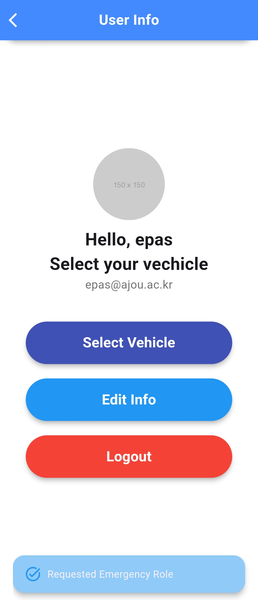
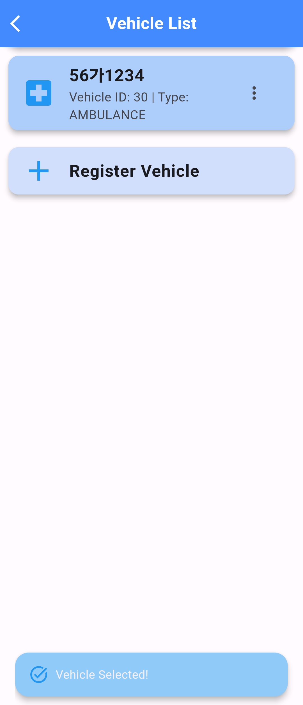
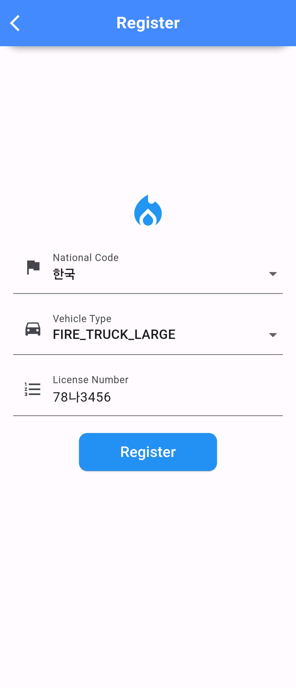
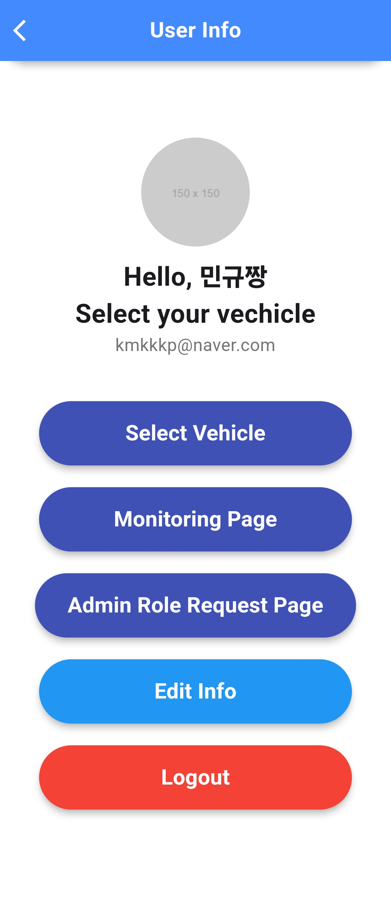

# [EPAS (Emergency vehicle Pre-Alerting System)]

Korean version Documentation: [한국어 문서](./README_KR.md)

## GDSC 2024 TOP 100 Awarded

<div align="center">
  
  
</div>

## Project Introduction Video

<div align="center">
  <a href="https://www.youtube.com/watch?v=fXNNaIofH3A">
    
  </a>
  <br>
  <a href="https://www.youtube.com/watch?v=fXNNaIofH3A" style="text-decoration:none; color:#0073e6; font-weight:bold;">
    
  </a>
</div>


## How to run and test EPAS

To run and test EPAS, please refer to the following **[link](./docs/test.md)**.

The results of the test and the implementation process are detailed in the documentation below.

## Round 2 Submission Improvement

- [Round 2 Submission Improvement](#round-2-improvement)
  - [EPAS Embedded Development](#epas-embedded-development)
    - [Project Introduction](#project-introduction)
    - [Operation Method](#operation-method)
    - [Expected Effects](#expected-effects)
  - [EPAS Social Rewarding System Development](#epas-social-rewarding-system-development)
  - [EPAS API Pluginization](#epas-api-pluginization)
    - [EPAS General User API](#epas-general-user-api)
    - [EPAS Emergency Vehicle API](#epas-emergency-vehicle-api)
  - [EPAS Application Optimization](#epas-application-optimization)

Preparing Round 2 Submission, we have improved and added features to EPAS. There are [EPAS Embedded Development](#epas-embedded-development), [EPAS Social Rewarding System Development](#epas-social-rewarding-system-development), [EPAS API Pluginization](#epas-api-pluginization), [EPAS Application Optimization](#epas-application-optimization).

Through this, we aimed to expand EPAS to be used worldwide so that more people can use it. EPAS is developed with scalability so that it can be used worldwide by adding map data to the road network calculation engine. Also, if EPAS uses Google Maps API, it can provide more real-time route information.

The document is located below, so please go through the link above.

## Index

- [[EPAS (Emergency vehicle Pre-Alerting System)]](#epas-emergency-vehicle-pre-alerting-system)
  - [How to run and test EPAS](#how-to-run-and-test-epas)
  - [Project Introduction](#project-introduction)
  - [Project Repository](#project-repository)
  - [Team Ajou Moses](#team-ajou-moses)
  - [Tech Stack](#tech-stack)
  - [Development Tools](#development-tools)
  - [API Used](#api-used)
- [Algorithm](#algorithm)
  - [Map Matching Algorithm](#map-matching-algorithm)
  - [Alerting Target Selection Algorithm](#alerting-target-selection-algorithm)
- [Limitations of Service(Currently Supporting Only Korea)](#limitations-of-servicecurrently-supporting-only-korea)
- [Simulation Test Method](#simulation-test-method)
- [EPAS APP](#frontend-epas-app)
  - [Test Account](#test-account)
  - [Initial Page](#initial-page)
  - [1. Sign Up](#1-sign-up)
  - [2. Sign In](#2-sign-in)
  - [3. User Info](#3-user-info)
    - [3.1 General User](#31-general-user)
    - [3.2 Emergency Auth User](#32-emergency-auth-user)
    - [3.3 Admin](#33-admin)
      - [3.3.1 Admin Role Request Page](#331-admin-role-request-page)
      - [3.3.2 Monitoring Page](#332-monitoring-page)
  - [4. Map Page](#4-map-page)
  - [5. EPAS](#5-epas)
- [Backend Server](#backend-server)
  - [Database](#database)
  - [OSRM (Open Source Routing Machine)](#osrm-open-source-routing-machine)
  - [Spring boot server](#spring-boot-server)
- [Round 2 Improvement](#round-2-improvement)
  - [EPAS Embedded Development](#epas-embedded-development)
    - [Project Introduction](#project-introduction)
    - [Operation Method](#operation-method)
    - [Expected Effects](#expected-effects)
  - [EPAS Social Rewarding System Development](#epas-social-rewarding-system-development)
  - [EPAS API Pluginization](#epas-api-pluginization)
    - [EPAS General User API](#epas-general-user-api)
    - [EPAS Emergency Vehicle API](#epas-emergency-vehicle-api)
  - [EPAS Application Optimization](#epas-application-optimization)

## Project Introduction

- EPAS is a social infrastructure service that provides warning notifications to vehicle drivers so they can be aware of the approach of emergency vehicles in advance.
- The service provides warning notifications by considering the distance, speed, and direction of emergency and surrounding vehicles through a filtering algorithm.
- Through these warning notifications, vehicle drivers can yield the road to emergency vehicles without panic, and emergency vehicles can reach their destinations quickly.

## Project Repository

|       Repository Name        |         Description          |                                          Link                                          |
| :--------------------------: | :--------------------------: | :------------------------------------------------------------------------------------: |
|           EPAS APP           |       Flutter EPAS App       |                [EPAS APP](https://github.com/Ajou-Soft-19/service-app)                 |
|     EPAS Service server      |     EPAS Backend Server      |         [EPAS Service server](https://github.com/Ajou-Soft-19/service-server)          |
| EPAS Vehicle Tracking Server | EPAS Vehicle Tracking Server |  [EPAS Vehicle Tracking Server](https://github.com/Ajou-Soft-19/spring-socket-server)  |
|  EPAS Authentication server  |  EPAS Authentication Server  | [EPAS Authentication server](https://github.com/Ajou-Soft-19/Spring-JWT-Login-server)  |
|        EPAS Simulator        | EPAS Road Network Simulator  |            [EPAS Simulator](https://github.com/Ajou-Soft-19/road-simulator)            |
|     EPAS Embedded Device     |     EPAS Embedded Device     | [EPAS Embedded Device](https://github.com/Ajou-Soft-19/EPAS-Client/tree/main/embedded) |
|    EPAS Social Rewarding     | EPAS Social Rewarding System |      [EPAS Social Rewarding System](https://github.com/Ajou-Soft-19/service-web)       |
|    EPAS API Pluginization    |    EPAS API Pluginization    |  [EPAS API Pluginization](https://github.com/Ajou-Soft-19/EPAS-Client/tree/main/api)   |

## Team Ajou Moses

| 정선문                                                                                                           | 장연지                                                                                                           | 김민규                                                                                                          |
| ---------------------------------------------------------------------------------------------------------------- | ---------------------------------------------------------------------------------------------------------------- | --------------------------------------------------------------------------------------------------------------- |
| [](https://github.com/bandall) | [](https://github.com/MillPRE) | [](https://github.com/kmkkkp) |
| Backend                                                                                                          | Backend                                                                                                          | Frontend                                                                                                        |

## Tech Stack

<div align="center">
    
    
    
    
    <br>
    
    
    
    <br>
    
    
    
</div>

<br>

## Development Tools

<div align="center">
    
    
    
    
    <br>
    
    
    
    <br>
    
    
    
</div>

## API Used

<div align="center">
    
    
</div>

<br>

# Algorithm

## Map Matching Algorithm

We use GPS data to track the location of a vehicle in real time. However, GPS data may differ from the actual location. To correct this, we use a map matching algorithm. The map matching algorithm converts GPS data to a location on the actual road network.

Below are comparison images before and after using map matching.

|                     Before Map Matching                      |                     After Map Matching                     |
| :----------------------------------------------------------: | :--------------------------------------------------------: |
|  |  |

This allows us to accurately determine which checkpoint the emergency vehicle is passing through, which road it is passing through, etc. Using the location and azimuth on the road network obtained here, we select the target for the alert and send the alert message.

|   Accurate Vehicle Location Detection Through Map Matching   |
| :----------------------------------------------------------: |
|  |

Initially in the development, we determined whether the checkpoint had been passed by using the straight-line distance between the vehicle and the checkpoint. However, this method did not take into account the vehicle's location and direction on the actual road network, making it difficult to accurately determine if the correct checkpoint had been passed. Therefore, we were able to improve this by considering the location on the road network obtained through the map matching algorithm and the direction of the vehicle to determine whether it passed the checkpoint.

## Alerting Target Selection Algorithm

The biggest technical problem we faced was deciding the standard for issuing alert notifications and how to deliver them. If the distance from the emergency vehicle is simply used as the criterion, many unnecessary alerts may be received because the distance from the emergency vehicle is close, even though it is far on the road network, which can degrade the user experience. To solve this problem, we selected the following algorithm.

When an emergency vehicle activates an emergency situation, the backend server continuously monitors the emergency vehicle (approximately every 1 second) and sends alerts to vehicles that are expected to encounter the emergency vehicle.

### **Alerting Target Selection Algorithm Pesudo-code**

```c
def issue_alert(emergency_car, checkpoints, vehicles):
  current_location = emergency_car.current_location
  next_checkpoint = get_next_checkpoint(current_location, checkpoints)

  # 1. Get vehicles within 500m radius of the next checkpoint
  nearby_vehicles = get_nearby_vehicles(next_checkpoint, vehicles, 500)

  # 2. Issue alert to vehicles using navigation
  for vehicle in nearby_vehicles:
    if vehicle.is_using_navigation:
      emergency_info = get_emergency_info(emergency_car)
      send_alert(vehicle, emergency_info)

  # 3. Issue alert to vehicles not using navigation but predicted to reach the checkpoint around the same time
  for vehicle in nearby_vehicles:
    if not vehicle.is_using_navigation:
      if will_arrive_simultaneously(vehicle, emergency_car, next_checkpoint):
        emergency_info = get_emergency_info(emergency_car)
        send_alert(vehicle, emergency_info)

  # 4. Issue additional alert to vehicles very close to the emergency vehicle
  very_close_vehicles = get_nearby_vehicles(current_location, vehicles, 160)
  for vehicle in very_close_vehicles:
    emergency_info = get_emergency_info(emergency_car)
    send_alert(vehicle, emergency_info)
```

The above code is the pseudocode of the alert target selection algorithm we selected.

The vehicle query range, checkpoint interval, etc. were determined after testing various scenarios through the simulation we created. [Road Network Simulation Tool](https://github.com/Ajou-Soft-19/road-simulator)

**[Vehicle Monitoring]**

|                                                Vehicle Monitoring                                                |
| :--------------------------------------------------------------------------------------------------------------: |
|  |

When a user runs the navigation app, the vehicle tracking server monitors the vehicle's location, speed, and azimuth. At this time, the user's information is stored as anonymous information.

|                                         Emergency Vehicle Navigation Path                                         |                                      Emergency Vehicle Navigation Checkpoint                                      |
| :---------------------------------------------------------------------------------------------------------------: | :---------------------------------------------------------------------------------------------------------------: |
|  |  |

1. The expected driving route of the emergency vehicle is divided into checkpoints at intervals of about 400m, and the next checkpoint that the emergency vehicle is currently heading to is selected as the alert target.

|                                              Alert Target Selection                                               |
| :---------------------------------------------------------------------------------------------------------------: |
|  |

2. Find `vehicles within a 500m radius` of the next checkpoint using the spatial query of `PostGIS`. (The blue circle in the picture above represents a 500m radius.)

3. For vehicles using navigation, an alert message containing the current location and expected route information of the emergency vehicle is sent via a socket. Each navigation application compares the set navigation driving route with the emergency vehicle's route and displays an alert notification to the user if they intersect.

|                                            Alert Message Transmission                                             |
| :---------------------------------------------------------------------------------------------------------------: |
|  |

4. For vehicles not using navigation, considering the current location and direction of the vehicle, **an alert is issued if it is expected to arrive at the next checkpoint faster than the emergency vehicle or at a similar time**. (Calculated on the road network using OSRM's table api.)
   The red dot represents the emergency vehicle, the blue dot represents the general vehicle, and the black dot represents the vehicle that received the alert.

|                       Filtering Alert Targets Far Away                        |
| :---------------------------------------------------------------------------: |
|  |

Vehicles that are close to the emergency vehicle in a straight line distance but far away on the road network are excluded from the warning targets.

5. In addition, to ensure that alerts are delivered to vehicles very close to the emergency vehicle, an additional alert is issued to `vehicles within 160m of the emergency vehicle` on the road network, regardless of the direction of movement. (The red circle corresponds to this.)

|                                         Alert Screen on Ordinary Vehicle 1                                         | Alert Screen on Ordinary Vehicle 2                                                                                 |
| :----------------------------------------------------------------------------------------------------------------: | ------------------------------------------------------------------------------------------------------------------ |
|  |  |

The issued alert contains information such as the current location of the emergency vehicle, the license number, and the expected driving route to the next checkpoint. This allows the navigation app to visualize the direction of approach and expected route of the emergency vehicle. The current location of the emergency vehicle is continuously transmitted after receiving the alert for 40 seconds. Users can check and respond to the location of the emergency vehicle in real time based on this information.

### Alert Message Type

Alert messages are sent through a socket connected to a regular vehicle. You can handle the emergency vehicle route through the emergency vehicle's API handler. Below are each message type.

**[ALERT]**

```json
{
  "code": 200,
  "messageType": "ALERT",
  "data": {
    "emergencyEventId": 410,
    "checkPointId": 16,
    "licenseNumber": "947Y1201",
    "vehicleType": "FIRE_TRUCK_MEDIUM",
    "currentPathPoint": 12,
    "pathPoints": [
      {
        "index": 3,
        "location": [
          127.10739,
          37.342598
        ]
      },
      {
        "index": 4,
        "location": [
          127.108576,
          37.342592
        ]
      },
      ...
      {
        "index": 33,
        "location": [
          127.116302,
          37.346454
        ]
      }
    ]
  }
}
```

- This is the message type sent when an alert is first issued. It sends emergency vehicle and expected route information. Route information includes from the current location of the emergency vehicle to the next checkpoint.
- If there are multiple emergency vehicles, the front distinguishes and processes using `licenseNumber` and `emergencyEventId`.

**[ALERT_UPDATE]**

```json
{
  "code": 200,
  "messageType": "ALERT_UPDATE",
  "data": {
    "licenseNumber": "947Y1201",
    "longitude": 127.109039,
    "latitude": 37.343817
  }
}
```

- For vehicles that have received alerts, the location of the emergency vehicle is updated in real time for about 40 seconds. EPAS app displays the real-time location of the emergency vehicle to the user using this information.

**[ALERT_END]**

```json
{
  "code": 200,
  "messageType": "ALERT_END",
  "data": {
    "licenseNumber": "947Y1201"
  }
}
```

- When the alert to be sent to the alert target is terminated, the above message is sent.

# Limitations of Service(Currently Supporting Only Korea)

At present, our service is primarily constrained by the geographical data we utilize, which is sourced exclusively from [OSRM's map data of Korea](https://osm.kr). Consequently, our ability to provide map matching and warning alerts is strictly limited to the territory of Korea. This significant limitation should be taken into account when considering the use of our service outside of this specific region. For testing within the Korean territory, a [simulation test tool](#simulation-test-method) is available.

# Simulation Test Method

We tested the algorithm for selecting alert targets through road network simulation. The code to run the simulation can be found in the repository below.

| Road Network Simulator Repository |                                     Link                                      |
| :-------------------------------: | :---------------------------------------------------------------------------: |
|    EPAS Road Network Simulator    | [EPAS Road Network Simulator](https://github.com/Ajou-Soft-19/road-simulator) |

For detailed information on the simulation method and explanation, please refer to the above repository and the [Monitoring Page](#332-monitoring-page) in the front-end table of contents.

# Frontend EPAS App

## Test Account

| Role               | Email                  | Password          |
| ------------------ | ---------------------- | ----------------- |
| `Emergency, Admin` | `adminepas@ajou.ac.kr` | `adminepas1234!?` |
| `Emergency`        | `epas@ajou.ac.kr`      | `1q2w3e4r!`       |

By this account, you can test the emergency vehicle registration and the admin page. For more information, please refer to the following.

## Initial Page

| Location Permission Screen                           | Initial Screen                                                                                                              | User Info Screen                        |
| ---------------------------------------------------- | --------------------------------------------------------------------------------------------------------------------------- | --------------------------------------- |
|     |                                                                                        |  |
| You need to set location permissions to run the app. | This is the map page for general users. By pressing the settings button, you will be taken to the account information page. | You can log in or sign up here.         |

## 1. Sign Up

| Account Creation Initial Screen                       | Account Creation Form                       | Account Creation Success                       |
| ----------------------------------------------------- | ------------------------------------------- | ---------------------------------------------- |
|  |  |  |

## 2. Sign In

| Login Initial Screen                       | Login Form                                 |
| ------------------------------------------ | ------------------------------------------ |
|  |  |

## 3. User Info

### 3.1 General User

| General User Account                            | After Requesting<br> Emergency Vehicle<br> Authorization |
| ----------------------------------------------- | -------------------------------------------------------- |
|  |           |

> Once the administrator approves the authorization, you can check the updated authorization status at Check Auth Request.

### 3.2 Emergency Auth User

| Emergency Vehicle Account                         |
| ------------------------------------------------- |
|  |

> You can select the vehicle to register as an emergency situation through the Select Vehicle button.

| Vehicle Selection                             | Vehicle Registration                             | Vehicle Registration Success                             |
| --------------------------------------------- | ------------------------------------------------ | -------------------------------------------------------- |
|  |  |  |

### 3.3 Admin

| Admin Page                                   |
| -------------------------------------------- |
|  |

#### 3.3.1 Admin Role Request Page

| Role Management Page                                        |
| ----------------------------------------------------------- |
|  |

#### 3.3.2 Monitoring Page

| Initial Screen                                     |
| -------------------------------------------------- |
|  |

| Vehicle Information                                |
| -------------------------------------------------- |
|  |

> The small dots on the screen represent vehicles. When you click a dot, the vehicle information pops up in a modal window.

| Dots                                              | Explanation          |
| ------------------------------------------------- | -------------------- |
|    | Emergency Vehicles   |
|   | Not-Alerted Vehicles |
|  | Alerted Vehicles     |

By selecting the emergency vehicle on the right, you can check the emergency path, checkpoints, etc. of the emergency vehicle. In addition, vehicles that have received alerts from the emergency vehicle are displayed in black in real time on the screen. You can deselect by pressing the `x` button.

| Emergency Vehicle Confirmation                     |
| -------------------------------------------------- |
|  |

> You can see the path and alert boundary for each emergency vehicle.

- You can cancel the vehicle selection with the `Unselect` button.
- You can define the range of the area displayed on the screen with the `Filter` button.
- You can pin the screen to the selected vehicle with the `Pin` button.

## 4. Map Page

> The usage is the same as common navigation.

| Initial Screen                        | Location Search List                        | Route Search                                                          | Guide Start                        | Navigation End                                                                         |
| ------------------------------------- | ------------------------------------------- | --------------------------------------------------------------------- | ---------------------------------- | -------------------------------------------------------------------------------------- |
|  |  |                                    |  |                                                   |
|                                       | You can select your desired destination.    | The ETA(Estimated Time of Arrival) and Distance values are displayed. |                                    | The guide ends when you arrive within 30m of the destination or press the back button. |

## 5. EPAS

> For general vehicles, you receive emergency situation alerts.

| First Alert Confirmation                                                                          | Reflecting Emergency Vehicle Location                        | Multiple Emergency Situation Registration                        |
| ------------------------------------------------------------------------------------------------- | ------------------------------------------------------------ | ---------------------------------------------------------------- |
|                                                    |  |  |
| If the media sound is on, you will hear a beep and the current location of the emergency vehicle. | The current location of the emergency vehicle is reflected.  | Multiple emergency vehicles are also reflected.                  |

> For emergency vehicles, you can send emergency situation alerts.

| Initial Screen                               | After Starting Navigation                    |
| -------------------------------------------- | -------------------------------------------- |
|  |  |

# Backend Server

|                                                Server Stack                                                |
| :--------------------------------------------------------------------------------------------------------: |
|  |

The backend server uses the following technology stack. The WAS is Spring Boot, and the DB uses PostgreSQL and Redis. Also, REST API and Redis Pub/Sub are used for communication between servers.

Each server components are build by using Docker and deployed.

## Database

|              PostgreSQL ERD               |
| :---------------------------------------: |
|  |

The core database uses PostgreSQL. The most important tables are as follows:

|   Table Name    |                                                                   Description                                                                    |
| :-------------: | :----------------------------------------------------------------------------------------------------------------------------------------------: |
|     member      |                                                             Stores user information.                                                             |
|     vehicle     |                      Stores user vehicle information such as the registration number, type of vehicle, and vehicle number.                       |
| vehicle_status  | Stores the location, speed, and azimuth of the user's vehicle. Supports location-based searches through Postgis' spatial data type and indexing. |
| navigation_path |                                                  Stores information on the user's route search.                                                  |
|   check_point   |                                          Stores checkpoint information when an emergency is registered.                                          |
| emergency_event |                             Stores information on registered emergencies. Used for emergency management and logging.                             |
|  alert_record   |                                       Stores alert notification information sent when an emergency occurs.                                       |

## OSRM (Open Source Routing Machine)

Due to the nature of the service, there are many calculations on the road network and the route search API. As a result, it is expensive to use commercial route search APIs such as Naver or Kakao. Therefore, we provide a route search service using OSRM. [OSRM](https://project-osrm.org/) builds a road network based on OpenStreetMap data and provides a route search service based on it.

Fortunately, we were able to use road data from Korea, and based on this, we were able to create an emergency vehicle alert service.

| Used API |               Description               |
| :------: | :-------------------------------------: |
|  route   |            Route search API             |
|  match   |   Map matching API based on GPS data    |
|  table   | Matrix route search and calculation API |

## Spring boot server

There are a total of 3 WAS configured with Spring Boot. Each server has the following roles:

|       Server Name       |                                                                                                    Description                                                                                                     |
| :---------------------: | :----------------------------------------------------------------------------------------------------------------------------------------------------------------------------------------------------------------: |
|  Authentication Server  |                                                                                   Manages user authentication and authorization.                                                                                   |
|   Main Service Server   |                                                  Manages vehicle registration, route search API, emergency management, and calculation of alert issuance targets.                                                  |
| Vehicle Tracking Server | Monitors vehicle information in real time. Updates the location, speed, azimuth, etc. of the vehicle in real time, maps the location of the vehicle to the road through map matching, and delivers it to the user. |

### Authentication Server

Manages user authentication and authorization. It provides features such as login, sign-up, password recovery, and user information modification. Also, it stores user authentication information and provides authentication and authorization features by issuing JWT to authenticated users.

To access other services, you must send a request with the JWT issued by the Authentication Server in the header. This ensures user authentication and authorization.

For more details, please refer to [Authentication Server](https://github.com/Ajou-Soft-19/Spring-JWT-Login-server).

### Main Service Server

Manages vehicle registration, route search API, emergency management, and calculation of alert issuance targets. It calls the route search API according to the user's request, calculates the route of the emergency vehicle when an emergency occurs, and delivers it to the emergency vehicle. Also, it continuously tracks the emergency vehicle using the location of the emergency vehicle and the navigation route, and sends alert messages to nearby vehicles.

The main APIs provided are as follows:

**Route Search API**
| API Name | Method | URL | Description |
| :------: | :----: | --- | ----------- |
| route | POST | /api/navi/route | Provides a route based on OSRM. |
| emergency route | POST | /api/emergency/navi/route | Provides an emergency route based on OSRM. |
| get path | GET | /api/emergency/navi/path | Returns the saved route. |
| remove path | POST | /api/emergency/navi/path/remove | Removes the route. |

**Emergency Management API**

|         API Name         | Method | URL                           | Description                     |
| :----------------------: | :----: | ----------------------------- | ------------------------------- |
| register emergency event |  POST  | /api/emergency/event/register | Registers an emergency.         |
|   end emergency event    |  POST  | /api/emergency/event/end      | Ends an emergency.              |
|   get emergency event    |  GET   | /api/emergency/event          | Returns registered emergencies. |

Here is the English version of the provided description.

**Alert Target Calculation API**

```java
    @Bean
    public ChannelTopic alertBroadcast() {
        return new ChannelTopic("alertBroadcast");
    }

    @Bean
    public ChannelTopic updateCurrentPathPoint() {
        return new ChannelTopic("updateCurrentPathPoint");
    }
```

- Implements alert target calculation and alert message transmission using Redis Pub/Sub.
- The server receives updates on the current location of the emergency vehicle from the vehicle location tracking server through the `updateCurrentPathPoint` channel and calculates the alert targets. The server sends an alert message to the vehicle location tracking server via the `alertBroadcast` channel to deliver the alert message to the vehicles that become alert targets.

### Vehicle Tracking Server

The server monitors vehicle information in real time. It updates the location, speed, azimuth, etc. of the vehicle in real time, maps the location of the vehicle to the road through map matching, and delivers it to the user.

The server communicates messages with the client through socket communication.

**Socket Communication API**

|     API Name     | Method | URL                    | Description                                                                                      |
| :--------------: | :----: | ---------------------- | ------------------------------------------------------------------------------------------------ |
|      socket      |  wss   | /ws/my-location        | Communicates location information of the vehicle, alert messages, etc. via socket communication. |
| emergency socket |  wss   | /ws/emergency-location | Socket communication API for emergency vehicles.                                                 |

**Client Message Type for Socket Communication**

| Message Type | Description                                                |
| :----------: | ---------------------------------------------------------- |
|     INIT     | Sets initial data when socket connection is made.          |
|    UPDATE    | Updates the location, speed, azimuth, etc. of the vehicle. |

**Server Message Type for Socket Communication**

| Message Type | Description                                                                                                                                      |
| :----------: | ------------------------------------------------------------------------------------------------------------------------------------------------ |
|   RESPONSE   | When the client sends an UPDATE message, the server sends a RESPONSE message to the client. The RESPONSE sends map-matched location information. |
|    ALERT     | Sends an alert message. Includes information about the emergency vehicle.                                                                        |
| ALERT_UPDATE | Updates the alert message.                                                                                                                       |
|  ALERT_END   | Notifies the end of the alert message.                                                                                                           |

# Round 2 Improvement

- [Round 2 Improvement](#round-2-improvement)
  - [EPAS Embedded Development](#epas-embedded-development)
    - [Project Introduction](#project-introduction)
    - [Operation Method](#operation-method)
    - [Expected Effects](#expected-effects)
  - [EPAS Social Rewarding System Development](#epas-social-rewarding-system-development)
  - [EPAS API Pluginization](#epas-api-pluginization)
    - [EPAS General User API](#epas-general-user-api)
    - [EPAS Emergency Vehicle API](#epas-emergency-vehicle-api)
  - [EPAS Application Optimization](#epas-application-optimization)

## EPAS Embedded Development

### Project Introduction

EPAS was initially developed as a plugin to be embedded in navigation, but it was also implemented as a separate embedded device for users who do not use (or have difficulty using) navigation. The EPAS client device does not require a large computing power, only GPS and network communication functions. Therefore, it can run sufficiently on low-performance single-threaded embedded systems such as Arduino. This allows existing vehicles to add the EPAS system at a low cost, and if a smartphone or vehicle that has navigation system, the EPAS can be used with only a software update without additional hardware.

Source code can be found at this link: [EPAS-Embeded-Client](https://github.com/Ajou-Soft-19/EPAS-Client/blob/main/embedded/gsc_node_mcu.ino)

|                                                                                        EPAS Implementaion                                                                                        |                                                                                        EPAS Client Divice Prototype                                                                                        |
| :----------------------------------------------------------------------------------------------------------------------------------------------------------------------------------------------: | :--------------------------------------------------------------------------------------------------------------------------------------------------------------------------------------------------------: |
|  |  |

The above picture is a prototype picture of the developed EPAS client device. The hardware used in this device is as follows.

| No. | Name                | Quantity | Price (USD) |
| --- | ------------------- | -------- | ----------- |
| 1   | NodeMCU V3          | 1        | $1.8        |
| 2   | GPS Module (Neo-7M) | 1        | $5.7        |
| 3   | LCD (16x2)          | 1        | $1.0        |
| 4   | DFPlayer Mini       | 1        | $0.8        |
| 5   | Speaker             | 1        | $1.3        |
| 6   | Micro SD (16GB)     | 1        | $3.0        |

**Total Price: $13.6**

Prototype was made for development and testing purposes, and actual products can be made with smaller and cheaper hardware through wholesale.

## Operation Method

|                                                        EPAS Warning Message                                                        |
| :--------------------------------------------------------------------------------------------------------------------------------: |
|  |

- When an emergency vehicle warning is issued, it displays the **license number of the emergency vehicle**, **the direction of approach of the emergency vehicle**, and **the number of emergency vehicles around**.

EPAS Client Device checks its current location through the GPS module and sends the current location to the [EPAS Vehicle Monitoring Server](https://github.com/Ajou-Soft-19/spring-socket-server) via socket communication. Based on this, the EPAS server checks if an emergency vehicle is passing by and if it is expected to meet an emergency vehicle, it sends a warning message to the client device. The client device receives this and displays a warning message on the LCD and outputs a warning sound through the DFPlayer Mini. At this time, the user can check the license number of the emergency vehicle and the direction in which the emergency vehicle is approaching through the LCD monitor and speaker.

If there are multiple emergency vehicles around, the EPAS client will display warning messages in order and notify the user. Users can be aware of emergency vehicles in advance and respond to them.

## Expected Effects

EPAS client devices can expect the following effects.

1. **Ensuring User Safety**: By recognizing and avoiding the approach of emergency vehicles in advance, it ensures the safety of users.
2. **Accessibility to Existing Vehicles**: Existing vehicles can also use the EPAS system at a low cost, making it highly accessible.
3. **User Convenience**: Users can easily check the direction of approach of emergency vehicles through the LCD and speaker, making it easy to understand the surrounding situation.
4. **Improving Traffic Flow**: If general vehicle drivers can recognize and respond to the approach of emergency vehicles in advance, they can efficiently create a path for emergency vehicles. This can improve traffic flow and contribute to reducing traffic congestion.
5. **Improving Social Awareness**: By promoting and using the EPAS system, the awareness of emergency vehicles among drivers can be improved. By naturally establishing a culture of giving way to emergency vehicles, the overall emergency response capability of society can be enhanced.
6. **Technical Scalability**: The EPAS client device is a cheap solution that can be easily installed in existing vehicles, but various technical expansions are possible in the future. For example, by utilizing artificial intelligence to analyze the user's driving habits, more effective response measures to the approach of emergency vehicles can be proposed.

If the EPAS system is introduced into a social-based system, it can provide great help for the passage of emergency vehicles at a low cost and contribute to the safe driving of users.

## EPAS Social Rewarding System Development

Through this [link](https://ajou-epas.xyz/), you can access the EPAS Social Rewarding Dashboard.

Our team developed the EPAS Social Rewarding System to encourage more people to use EPAS. This allows you to count the number of people using EPAS by region and encourage users to use EPAS through friendly competition.

|                                     EPAS Social Rewarding System1                                     |                                     EPAS Social Rewarding System2                                     |                                     EPAS Social Rewarding System3                                     |
| :---------------------------------------------------------------------------------------------------: | :---------------------------------------------------------------------------------------------------: | :---------------------------------------------------------------------------------------------------: |
|  |  |  |

EPAS Social Rewarding System counts the records of notifications sent to surrounding vehicles when an emergency vehicle is operating in an emergency situation. This allows users to know that many people are using EPAS in their area or other areas, and encourages more people to use EPAS.

EPAS Social Rewarding System also uses Google Maps API, so it is developed with scalability to be used worldwide by adding map data.

Source code can be found at this link: [EPAS Social Rewarding System](https://github.com/Ajou-Soft-19/service-web)

## EPAS API Pluginization

|                                    EPAS API Documentation Example                                     |                                    EPAS API Documentation Example                                     |
| :---------------------------------------------------------------------------------------------------: | :---------------------------------------------------------------------------------------------------: |
|  |  |

To make EPAS more accessible to more people, we have organized the EPAS API and created a detailed document on how to use it so that developers can easily use EPAS. This allows more people to use the EPAS system not only in the EPAS app but also in other applications.

### EPAS General User API

General User API for EPAS is provided for easy use by developers. Through this, developers can easily apply the functions of EPAS to their applications. In addition, the general user API does not collect user information, and only requires the location information of anonymous users, so it is easy to use.

Through socket communication, messages in a fixed format are sent and received, so it can be easily used in embedded systems such as Arduino. Developers only need to send the user's location information to the server, and all processing is done on the EPAS server.

For more information on the general user API of EPAS, please refer to [General User Application API Document](https://github.com/Ajou-Soft-19/EPAS-Client?tab=readme-ov-file#epas-api-documentation).

### EPAS Emergency Vehicle API

The emergency vehicle API requires more API endpoints than the EPAS general user API, such as registration, login, vehicle registration, emergency situation registration and cancellation. A detailed description of this is provided in [Emergency Vehicle Driver Application API Document](https://github.com/Ajou-Soft-19/EPAS-Client?tab=readme-ov-file#emergency-vehicle-driver-application-api).

## EPAS Application Optimization

|                                                   EPAS Mentoring                                                    |
| :-----------------------------------------------------------------------------------------------------------------: |
|  |

Threw Google mentoring, we improved the reliability of the EPAS application. Previously, the application did not properly control socket communication in the background, so the user's previous location information was maintained. In the last submission, we modified the server logic to close sessions that no longer send messages periodically.

We explained the problem to our mentor to solve the cause of the problem before this submission. He gave us best practices and appropriate solutions. Through this, we modified the application to properly close the socket connection when the app is disposed of.

Thank you, mentor!
