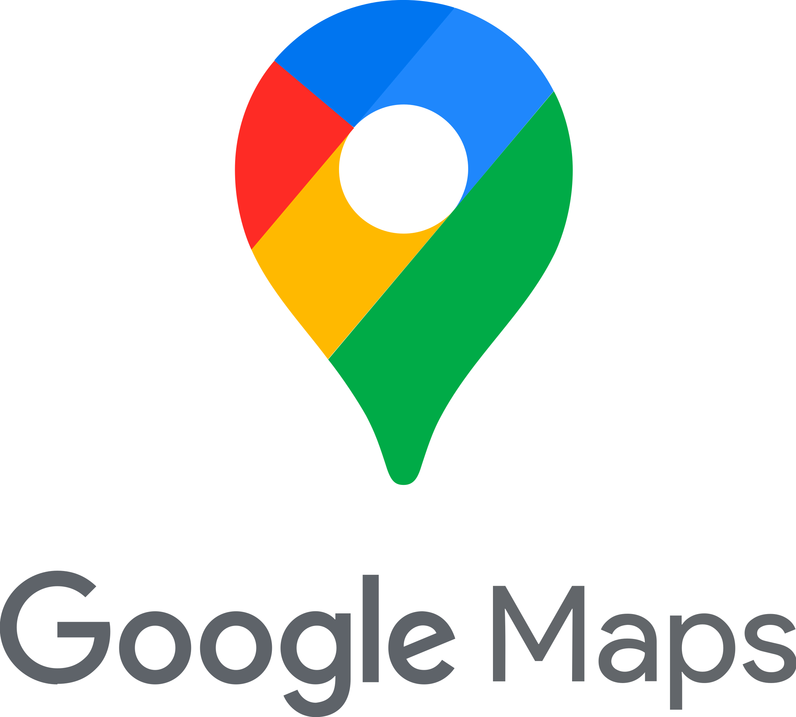
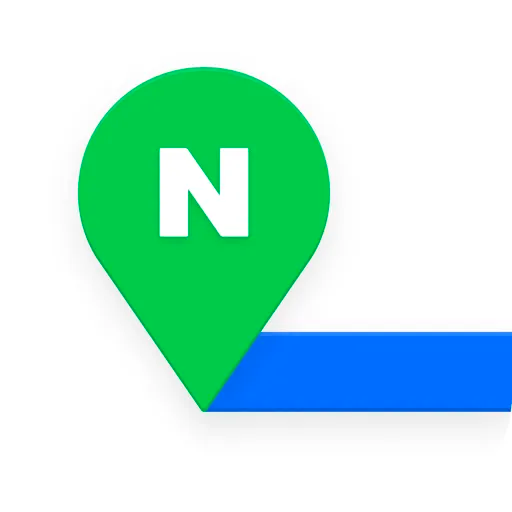
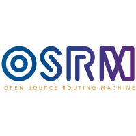

 # [EPAS (Emergency vehicle Pre-Alerting System)]

---
## 프로젝트 소개
- EPAS는 차량 주행자가 응급차량의 접근을 미리 알 수 있습니다.
- 응급차량은 응급상황에서 보다 쉽고 빠르게 목적지에 도달할 수 있습니다.
- 주행자는 응급차량의 접근을 보고 받아 사고 위험없이 미리 길을 터줄 수 있습니다.
---
## 팀원 구성
| 정선문 | 장연지 | 김민규 |
|-|-|-|
||||
|Backend|Backend|Frontend|

---

## 1. 개발 환경
### Backend
| SpringBoot                                                                                   |PostgreSQL|---|
|----------------------------------------------------------------------------------------------|---|---|
|  | | |

### Frontend
| Flutter                                                                             |
|-------------------------------------------------------------------------------------|
|  |

### 버전 및 이슈 관리
| Github                                                                                         |
|------------------------------------------------------------------------------------------------|
|  |

### 협업 툴
| Notion                                                                                                                      | Discord                                                                                                                                       |
|-----------------------------------------------------------------------------------------------------------------------------|-----------------------------------------------------------------------------------------------------------------------------------------------|
|  |  |

### 서비스 배포 환경
| Google Cloud                                                                                               |
|------------------------------------------------------------------------------------------------------------|
|  |

### 디자인
| Figma                                                                                                                                                                 |
|-----------------------------------------------------------------------------------------------------------------------------------------------------------------------|
|  |
---
## 2. 기술 소개

### API
| Google Map API                              | Naver Map API                               | Osrm API                                   |
|---------------------------------------------|---------------------------------------------|--------------------------------------------|
|  |  |  |

---

## 3. 페이지별 기능
### 3-1. 회원가입 화면
| 계정 생성 초기 화면 | 계정 생성 폼                         | 계정 생성 버튼 클릭                        | 
|-------------|---------------------------------|------------------------------------|
|        |  |  |
### 3-2. 로그인 화면
| 로그인 초기 화면                        | 로그인 폼                        | 로그인 성공                        |
|----------------------------------|------------------------------|-------------------------------|
|  |  |  |
### 3-3. Map 화면
| Map 화면                                           |
|--------------------------------------------------|
|  |
### 3-4. 네비게이션 화면
| 네비게이션 초기 화면                           | 네비게이션 목적지 검색                            | 찾은 경로 보여줌                           | 네비게이션 시작                            |
|---------------------------------------|-----------------------------------------|-------------------------------------|-------------------------------------| 
|  |  |  |  |

### 3-5. Account 화면
| Account 메인 화면                                | 사용자 이름 변경                                     | 사용자 이름 변경 완료                                  | 응급차량 권한 요청                                    | 응급차량 권한 요청 승인 결과 확인                           |
|----------------------------------------------|-----------------------------------------------|-----------------------------------------------|-----------------------------------------------|-----------------------------------------------|
|  |  |  |  |  |
### 3-6. 차량 등록 화면
| 차량 등록 초기 화면                             | 차량 추가 화면                            | 차량 추가 완료                            |
|-----------------------------------------|-------------------------------------|-------------------------------------|
|  |  |  |
### 3-7. 응급차량 응급 모드
| 응급차량 응급모드                         | 응급차량 일반모드                         | 응급차량 응급상황 주행시작                    |
|-----------------------------------|-----------------------------------|-----------------------------------|
|  |  |  |
### 3-8. 경고 알람 발생 화면
| 경고 알람 발생 화면                               |
|-------------------------------------------|
|  |
### 3-9. Admin 화면
| 관리자 Account 화면                      |   모니터링 페이지                     |
|-------------------------------------|-----------------------------|
|  |    |

### 3-10. 권한 관리 화면
|응급차량 권한 요청 승인/거절 페이지|
|-|
||

---
## 4. 알고리즘
### 4-1. ERD

### 4-2. Alert Logic

### 4-3. Map Matching Logic

### 4-4. Front Alert Logic