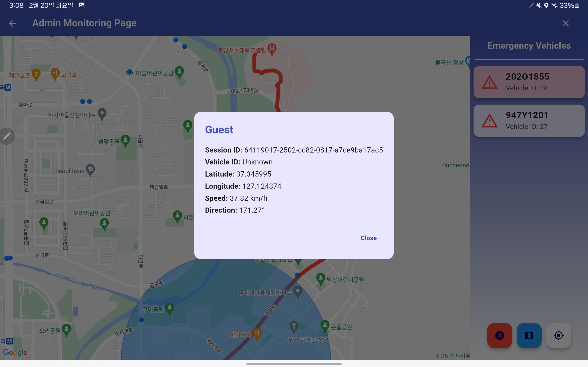

# [EPAS (Emergency vehicle Pre-Alerting System)]

- [[EPAS (Emergency vehicle Pre-Alerting System)]](#epas-emergency-vehicle-pre-alerting-system)
  - [프로젝트 소개](#프로젝트-소개)
  - [Team Ajou Moses](#team-ajou-moses)
  - [Project Repository](#project-repository)
  - [Tech Stack](#tech-stack)
  - [Development Tools](#development-tools)
  - [API Used](#api-used)
- [알고리즘](#알고리즘)
  - [맵 매칭 알고리즘](#맵-매칭-알고리즘)
  - [경고 대상 선정 알고리즘](#경고-대상-선정-알고리즘)
  - [경고 메시지 타입](#경고-메시지-타입)
- [제약사항](#제약사항)
- [시뮬레이션 테스트 방법](#시뮬레이션-테스트-방법)
- [프론트엔드 EPAS APP](#프론트엔드-epas-앱)
  - [테스트 계정](#테스트-계정)
  - [Initial Page](#initial-page)
  - [1. Sign Up](#1-sign-up)
  - [2. Sign In](#2-sign-in)
  - [3. User Info](#3-user-info)
    - [3.1 General User](#31-general-user)
    - [3.2 Emergency Auth User](#32-emergency-auth-user)
    - [3.3 Admin](#33-admin)
      - [3.3.1 Admin Role Request Page](#331-admin-role-request-page)
      - [3.3.2 Monitoring Page](#332-monitoring-page)
  - [4. Map Page](#4-map-page)
  - [5. EPAS](#5-epas)
- [백엔드 서버](#백엔드-서버)
  - [데이터베이스](#데이터베이스)
  - [OSRM (Open Source Routing Machine)](#osrm-open-source-routing-machine)
  - [Spring boot server](#spring-boot-server)
- [라운드2 발전 방향](#라운드2-발전-방향)
  - [EPAS Embedded 개발](#epas-embedded-개발)
    - [프로젝트 소개](#프로젝트-소개)
    - [동작 방식](#동작-방식)
    - [기대 효과](#기대-효과)
  - [EPAS Social Rewarding System 개발](#epas-social-rewarding-system-개발)
  - [EPAS API Plugin화](#epas-api-plugin화)
    - [EPAS 일반 사용자 API](#epas-일반-사용자-api)
    - [EPAS 응급차량 API](#epas-응급차량-api)
  - [EPAS 어플리케이션 최적화](#epas-어플리케이션-최적화)

## 프로젝트 소개

- EPAS는 차량 주행자가 응급 차량의 접근을 미리 알 수 있도록, 경고 알림을 제공하는 서비스입니다.
- 필터링 알고리즘을 통해 응급차량과 주변 차량의 거리, 속도, 방향 등을 고려하여 경고 알림을 제공합니다.
- 경고 알림을 통해 차량 주행자는 당황하지 않고 응급 차량에게 길을 양보할 수 있고, 응급 차량은 빠르게 목적지에 도달할 수 있습니다.

## Project Repository

|         리포지토리명          |             설명              |                                         링크                                          |
| :---------------------------: | :---------------------------: | :-----------------------------------------------------------------------------------: |
|           EPAS APP            |       Flutter EPAS App        |                [EPAS APP](https://github.com/Ajou-Soft-19/service-app)                |
|       EPAS 서비스 서버        |       EPAS 백엔드 서버        |          [EPAS 서비스 서버](https://github.com/Ajou-Soft-19/service-server)           |
|    EPAS 차량 모니터링 서버    |    EPAS 차량 모니터링 서버    |    [EPAS 차량 모니터링 서버](https://github.com/Ajou-Soft-19/spring-socket-server)    |
|        EPAS 인증 서버         |        EPAS 인증 서버         | [EPAS Authentication server](https://github.com/Ajou-Soft-19/Spring-JWT-Login-server) |
| EPAS 도로 네트워크 시뮬레이터 | EPAS 도로 네트워크 시뮬레이터 |    [EPAS 도로 네트워크 시뮬레이터](https://github.com/Ajou-Soft-19/road-simulator)    |
|    EPAS Embedded 단말      | EPAS Embedded 단말         | [EPAS Embedded Device](https://github.com/Ajou-Soft-19/EPAS-Client/tree/main/embedded)                                                              |
|   EPAS Social Rewarding     | EPAS 소셜 리워딩 시스템 | [EPAS Social Rewarding System](https://github.com/Ajou-Soft-19/service-web)                                                      |
|   EPAS API Pluginization     | EPAS API 문서        | [EPAS API 문서](https://github.com/Ajou-Soft-19/EPAS-Client/tree/main/api)                                                            |

## Team Ajou Moses

| 정선문                                                                                                           | 장연지                                                                                                           | 김민규                                                                                                          |
| ---------------------------------------------------------------------------------------------------------------- | ---------------------------------------------------------------------------------------------------------------- | --------------------------------------------------------------------------------------------------------------- |
| [](https://github.com/bandall) | [](https://github.com/MillPRE) | [](https://github.com/kmkkkp) |
| Backend                                                                                                          | Backend                                                                                                          | Frontend                                                                                                        |

## Tech Stack

<div align="center">
    
    
    
    
    <br>
    
    
    
    <br>
    
    
    
</div>

<br>

## Development Tools

<div align="center">
    
    
    
    
    <br>
    
    
    
    <br>
    
    
    
</div>

## API Used

<div align="center">
    
    
    
</div>

<br>

# 알고리즘

## 맵 매칭 알고리즘

차량의 위치를 실시간으로 추적하기 위해 GPS 데이터를 사용합니다. 하지만 GPS 데이터는 실제 위치와 차이가 있을 수 있습니다. 이를 보정하기 위해 맵 매칭 알고리즘을 사용합니다. 맵 매칭 알고리즘은 GPS 데이터를 실제 도로 네트워크 상의 위치로 변환해줍니다.

아래는 맵 매칭 사용 전과 후의 비교 사진입니다.

|                 맵 매칭 사용 전                  |                 맵 매칭 사용 후                  |
| :----------------------------------------------: | :----------------------------------------------: |
|  |  |

이를 통해 응급차량이 어떤 체크포인트를 지나가고 있는지, 어떤 도로를 통과하고 있는지 등을 정확하게 파악할 수 있습니다. 여기서 구한 도로 네트워크 상의 위치와 방위각을 이용해 경고 대상을 선정하고 경고 메시지를 전송합니다.

| 맵 매칭을 통해 정확한 차량 위치 파악 |
| :-----------------------------------: |
|  |

개발 초기에는 차량과 체크포인트의 직선 거리를 이용해 체크포인트를 지났는지 판단하였습니다. 하지만 이 방법은 실제 도로 네트워크 상에서 차량의 위치와 방향을 고려하지 않아, 정확한 체크포인트를 지나갔는지 판단하기 어려웠습니다. 따라서, 맵 매칭 알고리즘을 통해 구한 도로 네트워크 상의 위치와 차량의 방향을 고려하여 체크포인트를 지나갔는지 판단하도록 하여 이를 개선할 수 있었습니다.

## 경고 대상 선정 알고리즘

저희가 직면한 가장 큰 기술적 문제는 경고 알림의 발행 기준과 그 전달 방식을 결정하는 것이었습니다. 단순히 응급차와의 거리만을 기준으로 한다면, 도로 네트워크 상에서는 멀지만 응급차와의 거리가 가깝다는 이유로 불필요한 경고를 받는 경우가 많아져 사용자 경험을 저하시킬 수 있습니다. 이 문제를 해결하기 위해 아래와 같은 알고리즘을 선정하였습니다.

응급 차량이 응급 상황을 활성화하면 백엔드 서버에서 지속적으로 (약 1초 간격) 응급 차량을 모니터링하고, 응급 차량과 마주칠 것으로 예상되는 차량에게 경고를 발송합니다.

### **경고 대상 선정 알고리즘**

```c
def issue_alert(emergency_car, checkpoints, vehicles):
  current_location = emergency_car.current_location
  next_checkpoint = get_next_checkpoint(current_location, checkpoints)

  # 1. Get vehicles within 500m radius of the next checkpoint
  nearby_vehicles = get_nearby_vehicles(next_checkpoint, vehicles, 500)

  # 2. Issue alert to vehicles using navigation
  for vehicle in nearby_vehicles:
    if vehicle.is_using_navigation:
      emergency_info = get_emergency_info(emergency_car)
      send_alert(vehicle, emergency_info)

  # 3. Issue alert to vehicles not using navigation but predicted to reach the checkpoint around the same time
  for vehicle in nearby_vehicles:
    if not vehicle.is_using_navigation:
      if will_arrive_simultaneously(vehicle, emergency_car, next_checkpoint):
        emergency_info = get_emergency_info(emergency_car)
        send_alert(vehicle, emergency_info)

  # 4. Issue additional alert to vehicles very close to the emergency vehicle
  very_close_vehicles = get_nearby_vehicles(current_location, vehicles, 160)
  for vehicle in very_close_vehicles:
    emergency_info = get_emergency_info(emergency_car)
    send_alert(vehicle, emergency_info)
```

위 코드는 저희가 선정한 경고 대상 선정 알고리즘의 수도 코드입니다.

차량 쿼리 범위와 체크포인트 간격 등은 제작한 시뮬레이션을 통해, 여러 시나리오를 테스트한 후 결정하였습니다. [도로 네트워크 시뮬레이션 도구](https://github.com/Ajou-Soft-19/road-simulator)

**[차량 모니터링]**

|                                                  차량 모니터링                                                   |
| :--------------------------------------------------------------------------------------------------------------: |
|  |

사용자가 네비게이션 앱을 실행하면 차량 추적 서버를 통해 차량의 위치, 속도, 방위각을 모니터링 합니다. 이때 사용자의 정보는 익명 정보로 저장됩니다.

|                                             응급 차량 네비게이션 경로                                             |                                          응급 차량 네비게이션 체크포인트                                          |
| :---------------------------------------------------------------------------------------------------------------: | :---------------------------------------------------------------------------------------------------------------: |
|  |  |

1. 응급차량의 예상 주행 경로를 약 400m 간격으로 나누어 체크포인트로 저장하고, 응급차량이 현재 향하고 있는 다음 체크포인트를 중점으로 경고 대상을 선정합니다.

|                                                  경고 대상 선정                                                   |
| :---------------------------------------------------------------------------------------------------------------: |
|  |

2. 다음 체크포인트를 중심으로 반경 `500m 내의 차량`을 `PostGIS`의 공간 쿼리를 이용하여 찾습니다. (위 사진의 파란색 원이 500m 반경입니다.)

3. 네비게이션을 사용하는 차량에게는 응급차량의 예상 경로와 현재 위치 정보를 담은 경보 메시지를 소켓을 통해 전달합니다. 각 네비게이션 애플리케이션은 설정된 네비게이션 주행 경로와 응급차량의 경로를 비교하여 교차하는 경우 사용자에게 경고 알림을 보여줍니다.

|                                                 경고 메시지 전송                                                  |
| :---------------------------------------------------------------------------------------------------------------: |
|  |

4. 네비게이션을 사용하지 않는 차량에 대해서는 차량의 현재 위치와 이동 방향을 고려하여, **다음 체크포인트에 응급차량보다 빠르게 도착하거나 비슷한 시간에 도착할 것으로 예상되는 경우 경고를 발행**하도록 하였습니다. (OSRM의 table api를 활용해 도로 네트워크 상에서 계산했습니다.)

빨간색 점은 응급차량, 파란색 점은 일반 차량 그리고 검은색 점은 경고를 받은 차량을 나타냅니다.

|                    거리가 먼 경고 대상 필터링                    |
| :--------------------------------------------------------------: |
|  |

응급차량과 직선 거리로는 가깝지만 도로 네트워크 상에서 멀리 떨어진 차량은 경고 대상에서 제외됩니다.

5. 또한, 응급차량과 매우 가까운 차량에게 경고를 확실히 전달하기 위해, 이동 방향을 고려하지 않고 도로 네트워크 상에서 응급차량과 `160m 이내에 있는 차량`에게 추가적으로 경고를 발행하도록 하였습니다. (빨간원이 이에 해당합니다.)

|                                               일반 차량의 경고 화면1                                               | 일반 차량의 경고 화면2                                                                                             |
| :----------------------------------------------------------------------------------------------------------------: | ------------------------------------------------------------------------------------------------------------------ |
|  |  |

발행된 경고에는 응급차량의 현재 위치, 라이센스 번호, 다음 체크포인트까지의 예상 주행 경로 등의 정보가 포함되어 있습니다. 이를 통해 네비게이션 앱에서는 응급차량의 접근 방향과 예상 주행 경로를 시각화하여 보여줍니다. 응급차량의 현재 위치는 경고를 받은 후 40초 간격으로 계속해서 전송됩니다. 사용자는 이 정보를 토대로 응급차량의 위치를 실시간으로 확인하고 대응할 수 있습니다.

## 경고 메시지 타입

경고 메시지는 일반 차량과 연결된 소켓을 통해 전송해줍니다. 응급 차량의 API 핸들러를 통해 응급 차량 경로를 다룰 수 있습니다. 아래는 각 메시지 타입입니다.

**[ALERT]**

```json
{
  "code": 200,
  "messageType": "ALERT",
  "data": {
    "emergencyEventId": 410,
    "checkPointId": 16,
    "licenseNumber": "947Y1201",
    "vehicleType": "FIRE_TRUCK_MEDIUM",
    "currentPathPoint": 12,
    "pathPoints": [
      {
        "index": 3,
        "location": [
          127.10739,
          37.342598
        ]
      },
      {
        "index": 4,
        "location": [
          127.108576,
          37.342592
        ]
      },
      ...more data
      {
        "index": 33,
        "location": [
          127.116302,
          37.346454
        ]
      }
    ]
  }
}
```

- 경고가 처음 발행되었을 때 전송되는 메시지 타입입니다. 응급차량 및 예상 경로 정보를 전송해줍니다. 경로 정보는 응급차량의 현재 위치에서 다음 체크포인트까지 포함되어 있습니다.
- 응급차량이 여러 대일 경우 프론트에서 `licenseNumber`와 `emergencyEventId`를 이용해 구분해 처리 합니다.

**[ALERT_UPDATE]**

```json
{
  "code": 200,
  "messageType": "ALERT_UPDATE",
  "data": {
    "licenseNumber": "947Y1201",
    "longitude": 127.109039,
    "latitude": 37.343817
  }
}
```

- 경고를 받은 차량을 대상으로 약 40초간 응급 차량의 위치를 실시간으로 업데이트합니다. 이 정보를 이용해 EPAS 앱에서 응급차의 실시간 위치를 사용자에게 표시합니다.

**[ALERT_END]**

```json
{
  "code": 200,
  "messageType": "ALERT_END",
  "data": {
    "licenseNumber": "947Y1201"
  }
}
```

- 경고 대상자에게 보낼 경고가 종료되면 위의 메시지를 전송합니다.

# 제약사항

현재는 [OSRM의 한국의 지도 데이터](https://osm.kr)를 사용해 서비스를 제공하고 있습니다. 따라서, 현재는 한국 위치에서만 맵 매칭과 경고 알림을 제공합니다. 아래의 시뮬레이션 테스트 도구를 사용하면 한국에서 시뮬레이션을 테스트할 수 있습니다.

# 시뮬레이션 테스트 방법

도로 네트워크 시뮬레이션을 통해 경고 대상을 선정하는 알고리즘을 테스트하였습니다. 시뮬레이션을 실행하는 코드는 아래 리포지토리에서 확인할 수 있습니다.

| 도로 네트워크 시뮬레이터 리포지토리 |                                                                                             링크                                                                                             |
| :----------------------------------: | :------------------------------------------------------------------------------------------------------------------------------------------------------------------------------------------: |
|   EPAS 도로 네트워크 시뮬레이터    | [EPAS 도로 네트워크 시뮬레이터](https://github.com/Ajou-Soft-19/road-simulator)

시뮬레이션 방법과 설명에 대한 자세한 정보는 위 리포지토리와 프론트 엔드 목차의 [모니터링 페이지](#332-monitoring-page)를 참고해주세요.

# 프론트엔드 EPAS 앱

## 테스트 계정

| 권한 | 이메일 | 비밀번호 |
|------|-------|----------|
| `Emergency, Admin` | `adminepas@ajou.ac.kr` | `adminepas1234!?` |
| `Emergency` | `epas@ajou.ac.kr` | `1q2w3e4r!` |

이 계정을 통해 응급 차량 등록과 어드민 페이지를 테스트할 수 있습니다. 자세한 내용은 아래를 참고해주세요.

## Initial page

| 위치권한 화면 | 초기 화면                         | 유저 인포 화면 |
|-------------|---------------------------------|------------------------------------|
|  |  |  |
|위치 권한 설정을 해야 앱을 실행할 수 있습니다.|일반 사용자의 맵 페이지로, 설정버튼을 누르면 계정 정보 페이지로 넘어갑니다. |로그인하거나 회원가입할 수 있습니다.|

## 1. Sign up

| 계정 생성 초기 화면 | 계정 생성 폼                         | 계정 생성 성공   |
|-------------|---------------------------------|------------------------------------|
|  |  |  |

## 2. Sign in

| 로그인 초기 화면 | 로그인 폼                         |
|-------------|---------------------------------|
|  |  |

## 3. User Info

### 3.1 General User

| 일반사용자 계정 | 응급차량 권한 등록 권한 요청 후      |
|-------------|---------------------------------|
|  |  |

> 관리자가 권한을 수락하면, Check Auth Request로 권한이 수정된 것을 확인할 수 있습니다.

### 3.2 Emergency Auth User

| 응급차량 계정 |  
|-------------|
|  |
> 차량 선택 버튼을 통해 응급 상황으로 등록할 차량을 선택할 수 있다.

| 차량 선택 | 차량 등록 | 차량 등록 성공 |
|-------------|-----------------|---|
|  |  |  |

### 3.3 Admin

| 어드민 페이지 |  
|-------------|
|  |

#### 3.3.1 Admin Role Request Page

| 권한 관리 페이지 |  
|-------------|
|  |

#### 3.3.2 Monitoring Page

| 초기화면 |  
|-------------|
|  |

| 차량 정보 |  
|-------------|
|  |
> 화면 위에 작은 점들은 차량으로, 점을 누르면 차량 정보가 모달 창이 뜹니다.

| Dots | Explanation |
|------|-------------|
||Emergency Vehicles|
||Not-Alerted Vehicles|
||Alerted Vehicles|

오른쪽의 응급 차량을 선택하면 응급 차량의 응급 경로, 체크포인트 등을 확인할 수 있습니다. 또한 화면에 응급차량의 알림을 받은 차량들을 실시간으로 검은색으로 표시해줍니다. `x` 버튼을 누르면 선택을 취소할 수 있습니다.

| 긴급차량 별 확인 |  
|-------------|
|  |
> 응급차 별로 경로와 알림 경계를 볼 수 있습니다.  

- `Unselect` 버튼으로 차량 선택 버튼을 취소할 수 있습니다.  
- `Filter` 버튼으로 화면에 표시되는 영역의 범위를 정합니다.  
- `Pin` 버튼으로 선택한 차량을 중심으로 화면을 고정합니다.

## 4. Map Page

> 일반적인 네비게이션 사용법과 동일합니다.

| 초기화면 | 위치 검색 리스트 | 경로 탐색 | 가이드 시작 |네비게이션 종료|
|---|---|---|---|---|
||||||
||원하는 목적지를 선택할 수 있습니다.|ETA(Estimated Time of Arrival), Distance 값이 나옵니다. ||뒤로가기 버튼이나 목적지 30m 부근에 도착하면 가이드를 종료합니다.|

## 5. EPAS

> 일반 차량일 경우, 응급 상황의 알림을 받습니다.

| 첫 알림 확인 | 응급 차량 위치 반영 | 여러 응급 상황 등록 |
| --- | --- | --- |
|  |  |  |
|미디어 소리를 켜놓으면 비프음과 응급 차량의 현 위치를 말해줍니다.| 응급차의 현 위치를 반영합니다. | 여러 응급 차량도 반영됩니다. |

> 응급 차량일 경우, 응급 상황의 알림을 발송할 수 있습니다.

| 초기 화면 | 네비게이션 시작 후 |
| --- | - |
| ||

# 백엔드 서버

|                   Server Stack                   |
| :----------------------------------------------: |
|  |

백엔드 서버는 다음과 같은 기술 스택을 사용합니다. WAS는 Spring Boot를 사용하고, DB는 PostgrSQL와 Redis를 사용합니다. 또한, 서버 간 통신을 위해 REST API와 Redis Pub/Sub을 사용합니다.

각 서버 컴포넌트는 도커를 사용하여 빌드하고 배포합니다.

## 데이터베이스

|              PostgreSQL ERD               |
| :---------------------------------------: |
|  |

핵심 데이터베이스는 PostgreSQL을 사용합니다. 가장 중요한 테이블은 아래와 같습니다.

|   Table Name    |                                                        Description                                                        |
| :-------------: | :-----------------------------------------------------------------------------------------------------------------------: |
|     member      |                                                 사용자 정보를 저장합니다.                                                 |
|     vehicle     |                  사용자 차량 정보를 저장합니다. 차량의 등록 번호, 차량 종류, 차량 번호 등을 저장합니다.                   |
| vehicle_status  | 사용자 차량의 위치, 속도, 방위각 등을 저장합니다. Postgis의 공간 데이터 타입과 인덱싱을 통해 위치 기반 검색을 지원합니다. |
| navigation_path |                                           사용자의 경로 탐색 정보를 저장합니다.                                           |
|   check_point   |                                응급 상황 등록 시 응급차량의 체크포인트 정보를 저장합니다.                                 |
| emergency_event |                          응급 상황 등록 정보를 저장합니다. 응급 상황 관리 및 로깅에 사용됩니다.                           |
|   warn_record   |                                   응급 상황 발생 시 전송된 경고 알림 정보를 저장합니다.                                   |

## OSRM (Open Source Routing Machine)

서비스 특성상 길찾기 API와 도로 네트워크 상에서 매우 많은 연산이 발생합니다. 이로 인해 네이버나 카카오 등 상용 길찾기 API를 사용하기에는 비용이 많이 들어가게 됩니다. 따라서, OSRM을 사용하여 길찾기 서비스를 제공합니다. [OSRM](https://project-osrm.org/)은 OpenStreetMap 데이터를 기반으로 도로 네트워크를 구축하고, 이를 기반으로 길찾기 서비스를 제공합니다.

감사하게도 한국의 도로 데이터를 제공받아 사용할 수 있었고, 이를 기반으로 응급차량 경고 서비스를 제작할 수 있었습니다.

| 사용한 API |             설명              |
| :--------: | :---------------------------: |
|   route    |         경로 탐색 API         |
|   match    | GPS 데이터를 기반 맵 매칭 API |
|   table    |  행렬 경로 탐색 및 계산 API   |

## Spring boot server

스프링 부트로 구성한 WAS는 총 3가지가 있습니다. 각각의 서버는 다음과 같은 역할을 합니다.

|       Server Name       |                                                                             Description                                                                              |
| :---------------------: | :------------------------------------------------------------------------------------------------------------------------------------------------------------------: |
|  Authentication Server  |                                                                  사용자 인증 및 인가를 담당합니다.                                                                   |
|   Main Service Server   |                                     차량 등록, 길찾기 API, 응급 상황 관리, 경고 발행 대상 계산 등 핵심 서비스 기능을 담당합니다.                                     |
| Vehicle Tracking Server | 차량의 정보를 실시간으로 모니터링합니다. 차량의 위치, 속도, 방위각 등을 실시간으로 업데이트하고, 맵 매칭을 통해 차량의 위치를 도로로 매핑하여 사용자에게 전달합니다. |

### Authentication Server

사용자 인증 및 인가를 담당합니다. 사용자의 로그인, 회원가입, 비밀번호 찾기, 회원 정보 수정 등의 기능을 제공합니다. 또한, 사용자의 인증 정보를 저장하고, 인증된 사용자에게 JWT을 발급하여 인증 및 인가 기능을 제공합니다.

다른 서비스에 접근하기 위해서는 Authentication Server에서 발급받은 JWT를 헤더에 담아 요청을 보내야 합니다. 이를 통해 사용자의 인증 및 인가를 보장합니다.

자세한 내용은 [Authentication Server](https://github.com/Ajou-Soft-19/Spring-JWT-Login-server)를 참고해주세요.

### Main Service Server

차량 등록, 길찾기 API, 응급 상황 관리, 경고 발행 대상 계산 등 핵심 서비스 기능을 담당합니다. 사용자의 요청에 따라 길찾기 API를 호출하고, 응급 상황 발생 시 응급차량의 경로를 계산하여 응급차량에게 전달합니다. 또한, 응급차량의 위치와 네비게이션 경로를 이용해 지속적으로 응급차량을 추적하고, 주변 차량에게 경고 메시지를 전송합니다.

제공하는 핵심 API는 다음과 같습니다.

**길찾기 API**
| API Name | Method | URL | Description |
| :------: | :----: | --- | ----------- |
| route | POST | /api/navi/route | OSRM 기반의 경로를 제공합니다. |
| emergency route | POST | /api/emergency/navi/route | OSRM 기반의 비상 경로를 제공합니다. |
| get path | GET | /api/emergency/navi/path | 저장된 경로를 반환합니다. |
| remove path | POST | /api/emergency/navi/path/remove | 경로를 제거합니다. |

**응급 상황 관리 API**

|         API Name         | Method | URL                           | Description                    |
| :----------------------: | :----: | ----------------------------- | ------------------------------ |
| register emergency event |  POST  | /api/emergency/event/register | 응급 상황을 등록합니다.        |
|   end emergency event    |  POST  | /api/emergency/event/end      | 응급 상황을 종료합니다.        |
|   get emergency event    |  GET   | /api/emergency/event          | 등록된 응급 상황을 반환합니다. |

**경고 대상 계산 API**

```java
    @Bean
    public ChannelTopic alertBroadcast() {
        return new ChannelTopic("alertBroadcast");
    }

    @Bean
    public ChannelTopic updateCurrentPathPoint() {
        return new ChannelTopic("updateCurrentPathPoint");
    }
```

- Redis Pub/Sub을 사용하여 경고 대상 계산 및 경고 메시지 전송을 구현합니다.
- 차량 위치 추적 서버에서 응급차량의 현재 위치를 `updateCurrentPathPoint` 채널로 업데이트받고 경고 대상을 계산합니다. 경고 대상이 되는 차량에게 경고 메시지를 전달하기 위해 `alertBroadcast` 채널을 통해 차량 위치 추적 서버에 경고 메시지를 전달합니다.

### Vehicle Tracking Server

차량의 정보를 실시간으로 모니터링합니다. 차량의 위치, 속도, 방위각 등을 실시간으로 업데이트하고, 맵 매칭을 통해 차량의 위치를 도로로 매핑하여 사용자에게 전달합니다.

소켓 통신을 통해 서버와 메시지를 주고 받습니다.

**소켓 통신 API**

|     API Name     | Method | URL                    | Description                                                         |
| :--------------: | :----: | ---------------------- | ------------------------------------------------------------------- |
|      socket      |  wss   | /ws/my-location        | 소켓 통신을 통해 차량의 위치 정보나 경고 메시지 등을 주고 받습니다. |
| emergency socket |  wss   | /ws/emergency-location | 응급차량을 위한 소켓 통신 API 입니다.                               |

**소켓 통신 클라이언트 메시지 타입**

| Message Type | Description                                    |
| :----------: | ---------------------------------------------- |
|     INIT     | 소켓 연결 시 초기 데이터를 세팅합니다.         |
|    UPDATE    | 차량의 위치, 속도, 방위각 등을 업데이트합니다. |

**소켓 통신 서버 메시지 타입**

| Message Type | Description                                                                                                                          |
| :----------: | ------------------------------------------------------------------------------------------------------------------------------------ |
|   RESPONSE   | 클라이언트가 UPDATE 메시지를 보내면, 서버는 클라이언트에게 RESPONSE 메시지를 보냅니다. RESPONSE에는 맵매칭된 위치 정보를 전송합니다. |
|    ALERT     | 경고 메시지를 전송합니다. 응급차량의 정보가 포함됩니다.                                                                              |
| ALERT_UPDATE | 경고 메시지를 업데이트합니다.                                                                                                        |
|  ALERT_END   | 경고 메시지 종료를 알립니다.                                                                                                         |

# 라운드2 발전 방향

- [라운드2 발전 방향](#라운드2-발전-방향)
  - [EPAS Embedded 개발](#epas-embedded-개발)
    - [프로젝트 소개](#프로젝트-소개)
    - [동작 방식](#동작-방식)
    - [기대 효과](#기대-효과)
  - [EPAS Social Rewarding System 개발](#epas-social-rewarding-system-개발)
  - [EPAS API Plugin화](#epas-api-plugin화)
    - [EPAS 일반 사용자 API](#epas-일반-사용자-api)
    - [EPAS 응급차량 API](#epas-응급차량-api)
  - [EPAS 어플리케이션 최적화](#epas-어플리케이션-최적화)

라운드 2를 통해 EPAS 기능을 개선하고 추가하였습니다. 크게 [EPAS 임베디드 개발](#epas-embedded-개발), [EPAS 소셜 리워딩 시스템 개발](#epas-social-rewarding-system-개발), [EPAS API 플러그인화](#epas-api-plugin화), [EPAS 어플리케이션 최적화](#epas-어플리케이션-최적화)가 있습니다.

이를 통해 EPAS를 전 세계적으로 확장가능해 더 많은 사람들이 사용할 수 있도록 하고자 하였습니다. EPAS는 도로 네트워크 계산 엔진에 지도 데이터만 추가한다면 전 세계에서 사용할 수 있도록 확장성 있게 개발되었습니다. 또한 EPAS가 구글 길찾기 API를 사용한다면 더 실시간 경로 정보를 제공할 수 있습니다.

## EPAS Embedded 개발

### 프로젝트 소개

EPAS는 처음에는 네비게이션에 내장하기 위한 플러그인을 목표로 개발되었으나, 네비게이션을 사용하지 않는(또는 사용하기 힘든) 사용자들을 위해 별도의 임베디드 장치로도 구현되었습니다.
EPAS 클라이언트 디바이스는 큰 컴퓨팅 파워가 필요하지 않으며, GPS와 네트워크 통신 기능만 있으면 됩니다. 따라서 아두이노와 같은 저성능 싱글 쓰레드 임베디드 시스템에서도 충분히 동작 가능합니다. 이를 통해 기존의 차량들은 값싼 비용으로 EPAS 시스템을 추가할 수 있고, 스마트폰이나 네비게이션 시스템이 차량에 내장된 경우에는 별도의 하드웨어 추가 없이 소프트웨어 업데이트만으로 EPAS 시스템을 사용할 수 있습니다.

소스코드는 이 링크에서 확인할 수 있습니다: [EPAS-Embeded-Client](https://github.com/Ajou-Soft-19/EPAS-Client/blob/main/embedded/gsc_node_mcu.ino)

|                                                EPAS 회로 구성                                            |             EPAS Client Divice Prototype               |
| :------------------------------------------------------------------------------------------------: | :----------------------------------------------: |
|  |  |

위 사진은 개발된 EPAS 클라이언트 디바이스의 프로토타입 사진입니다. 이 디바이스에 사용된 하드웨어는 아래와 같습니다.

| 번호 | 이름             | 수량 | 가격 (USD) |
|------|----------------------|------|------------|
| 1    | NodeMCU V3           | 1    | $1.8       |
| 2    | GPS 모듈 (Neo-7M)     | 1    | $5.7       |
| 3    | LCD (16x2)           | 1    | $1.0       |
| 4    | DFPlayer Mini        | 1    | $0.8       |
| 5    | Speaker              | 1    | $1.3       |
| 6    | Micro SD 카드(16GB)   | 1    | $3.0       |

**총 비용 : 약 $13.6**

프로토타입은 개발 및 테스트 목적으로 제작되었으며, 실제 제품은 도매를 통해 더 작고 저렴한 하드웨어를 사용할 수 있고 손바닥 크기 정도의 크기로 제작할 수 있습니다.

### 동작 방식

| EPAS 경고 메시지 출력 |
| :-------------------: |
|  |

- 응급 차량 경고 발행 시 **응급차량의 라이선스 번호**, **응급차량의 접근 방향**과 **주위 응급차량 수**를 출력합니다.

EPAS 클라이언트 디바이스는 GPS 모듈을 통해 자신의 현재 위치를 확인하고 소켓 통신을 통해 [EPAS 차량 모니터링 서버](https://github.com/Ajou-Soft-19/spring-socket-server)에 현재 위치를 전송합니다. EPAS 서버는 이를 기준으로 주위에 응급차량이 지나가는지 확인하고, 응급차량과 마주칠 것으로 예상된다면 클라이언트 디바이스에 경고 메시지를 전송합니다. 클라이언트 디바이스는 이를 받아 LCD에 경고 메시지를 출력하고, 동시에 DFPlayer Mini를 통해 경고음을 출력합니다. 이때 사용자는 응급차량의 라이선스 번호와 응급차량이 접근하고 있는 방향을 LCD 모니터와 스피커를 통해 확인할 수 있습니다.

만약 주위에 복수의 응급차량이 있다면, EPAS 클라이언튼는 차례대로 경고 메시지를 출력하며 사용자에게 알립니다. 사용자는 이를 통해 응급 차량을 미리 인지하고 대응할 수 있습니다.

### 기대 효과

EPAS 클라이언트 디바이스는 다음과 같은 효과를 기대할 수 있습니다.

1. **사용자의 안전 보장**: 응급차량의 접근을 미리 인지하고 피할 수 있어, 사용자의 안전을 보장합니다.
2. **기존 차량에 대한 접근성**: 기존 차량에도 저렴한 비용으로 EPAS 시스템을 사용할 수 있어, 보급성이 높습니다.
3. **사용자 편의성**: 사용자는 응급차량의 접근 방향을 LCD와 스피커를 통해 확인할 수 있어, 주변 상황을 파악하기 쉽습니다.
4. **교통 흐름 개선**: 일반 차량 운전자가 응급차량의 접근을 미리 인지하고 대응할 수 있게 되면, 응급차량을 위한 길을 효율적으로 만들어 줄 수 있습니다. 이는 교통 흐름을 개선하고, 교통 혼잡을 줄이는 데 기여할 수 있습니다.
5. **사회적 인식 개선**: EPAS 시스템의 보급과 사용을 통해 운전자들 사이에 응급차량에 대한 인식이 개선될 수 있습니다. 응급차량에 길을 양보하는 문화가 자연스럽게 정착됨으로써, 사회 전체의 응급 상황 대응 능력이 강화될 수 있습니다.
6. **기술적 확장성**: EPAS 클라이언트 디바이스는 기존의 차량에 쉽게 설치할 수 있는 저렴한 솔루션이지만, 향후 다양한 기술적 확장이 가능합니다. 예를 들어, 인공지능을 활용하여 사용자의 운전 습관을 분석하고, 응급차량의 접근에 대한 더 효과적인 대응 방안을 제시할 수 있습니다.

EPAS 시스템을 사회 기반 시스템에 도입한다면 값싼 비용으로 응급차량의 통행에 큰 도움을 줄 수 있으며, 사용자들의 안전 운행에 기여할 수 있습니다.

## EPAS Social Rewarding System 개발

이 [링크](https://ajou-epas.xyz/)를 통해 접속할 수 있습니다.

저희 팀은 EPAS를 더 많은 사람들이 사용하도록 유도하기 위해 EPAS Social Rewarding System을 개발하였습니다. 이를 통해 지역별로 EPAS를 사용하는 사람들을 카운팅할 수 있고, 사용자들의 선의의 경쟁을 유도해 더 많은 사람들이 EPAS를 사용하도록 할 수 있습니다.

| EPAS Social Rewarding System1 | EPAS Social Rewarding System2 | EPAS Social Rewarding System3 |
| :--------------------------: | :--------------------------: | :--------------------------: |
|  |  |  |

EPAS Social Rewarding System은 응급차량이 응급상황에서 운행 중일 때 주변의 차량에게 알림이 간 기록을 통해 카운팅합니다. 이를 통해 사용자들은 자신의 지역 또는 다른 지역에서 EPAS를 사용하는 사람들이 많다는 것을 알 수 있고, 더 많은 사람들이 EPAS를 사용하도록 유도할 수 있습니다.

EPAS Social Rewarding System도 구글맵 API를 사용하기 때문에 지도 데이터만 추가한다면 전 세계에서 사용할 수 있도록 확장성 있게 개발되었습니다.

소스코드는 [EPAS Social Rewarding System](https://github.com/Ajou-Soft-19/service-web)을 통해 확인할 수 있습니다.

## EPAS API Plugin화

| EPAS API Documentation Example | EPAS API Documentation Example |
| :---------------------: | :---------------------: |
|  | 

EPAS를 더 많은 사람들이 사용할 수 있게 하기 위해 EPAS API를 정리하고 사용법을 자세히 설명한 문서를 작성해 개발자들이 쉽게 EPAS를 사용할 수 있게 했습니다. 이를 통해 EPAS 앱뿐만 아니라 다른 어플리케이션에서도 EPAS를 사용할 수 있어 더 많은 사람들이 EPAS 시스템을 사용할 수 있습니다.

### EPAS 일반 사용자 API

EPAS의 일반 사용자 API는 개발자가 쉽게 사용할 수 있도록 제공됩니다. 이를 통해 개발자들은 EPAS의 기능을 쉽게 자신의 어플리케이션에 적용할 수 있습니다. 또한 일반 사용자 API의 경우 사용자의 정보를 수집하지 않고, 익명 사용자의 위치 정보만을 필요로 하기 때문에 쉽게 사용할 수 있습니다.

소켓 통신을 통해 정해진 포맷의 메시지를 주고 받기 때문에 아두이노와 같은 임베디드 시스템에서도 쉽게 사용할 수 있습니다. 개발자는 사용자의 위치 정보를 서버에 전송하기만 하면 되고, 모든 처리는 EPAS 서버에서 이뤄집니다.

EPAS의 일반 사용자 API에 대한 자세한 내용은 [Ordinary User Application API](https://github.com/Ajou-Soft-19/EPAS-Client?tab=readme-ov-file#epas-api-documentation)를 통해 확인할 수 있습니다.

### EPAS 응급차량 API

응급 차량 API의 경우 회원가입, 로그인, 차량 등록, 응급 상황 등록 및 취소 등 EPAS 일반 사용자 API 보다 많은 API 엔드포인트를 필요로 합니다. 이에 대한 자세한 설명을 [Emergency Vehicle User Application API](https://github.com/Ajou-Soft-19/EPAS-Client?tab=readme-ov-file#emergency-vehicle-driver-application-api)에 작성해 두어 개발자들이 쉽게 사용할 수 있도록 하였습니다.

## EPAS 어플리케이션 최적화

| EPAS Mentoring |
| :-------------------: |
|  |

구글 멘토링을 통해 EPAS 어플리케이션의 신뢰성을 개선하였습니다. 기존에는 어플리케이션이 백그라운드에서 소켓 통신을 제대로 컨트롤하지 못 해 사용자의 이전 위치 정보가 그대로 유지되는 문제가 있었습니다. 지난 제출에서는 서버에서 주기적으로 더 이상 메시지를 보내지 않는 세션을 종료하도록 수정하였습니다.

이번 제출하서는 문제의 원인을 해결하기 위해 멘토님께 이에 대한 문제를 설명하였고, 멘토님께서는 이에 대한 해결책을 제시해 주셨습니다. 이를 통해 앱이 Dispose 될 때 소켓 연결이 정상적으로 종료되도록 수정하였습니다.
감사합니다 멘토님!
