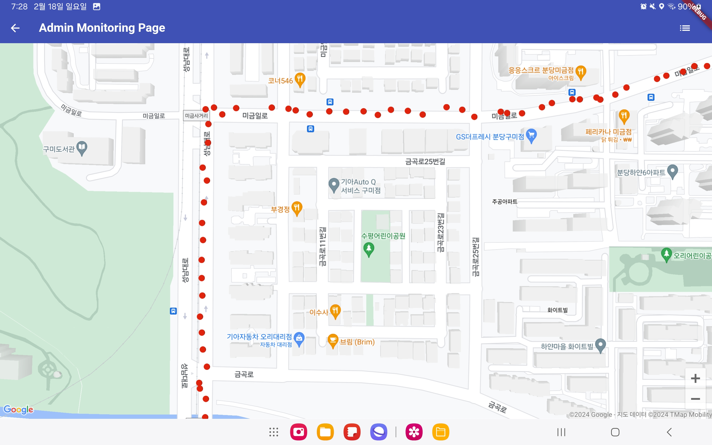
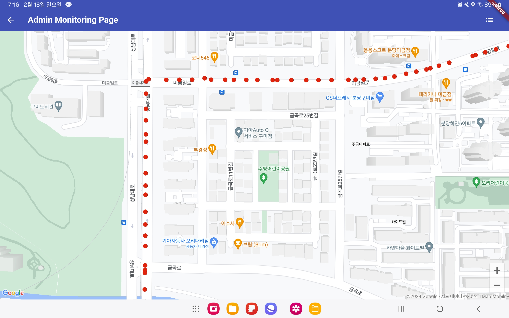

## 맵 매칭 알고리즘

차량의 위치를 실시간으로 추적하기 위해 GPS 데이터를 사용합니다. 하지만 GPS 데이터는 실제 위치와 차이가 있을 수 있습니다. 이를 보정하기 위해 맵 매칭 알고리즘을 사용합니다. 맵 매칭 알고리즘은 GPS 데이터를 실제 도로 네트워크 상의 위치로 변환해줍니다.

아래는 맵 매칭 사용 전과 후의 비교 사진입니다.

|                     맵 매칭 사용 전                     |                     맵 매칭 사용 후                      |
|:-------------------------------------------------:|:--------------------------------------------------:|
|  |  |

이를 통해 응급차량이 어떤 체크포인트를 지나가고 있는지, 어떤 도로를 통과하고 있는지 등을 정확하게 파악할 수 있습니다. 여기서 구한 도로 네트워크 상의 위치와 방위각을 이용해 경고 대상을 선정하고 경고 메시지를 전송합니다.

## 경고 대상 선정 알고리즘

저희가 직면한 가장 큰 기술적 문제는 경고 알림의 발행 기준과 그 전달 방식을 결정하는 것이었습니다. 단순히 응급차와의 거리만을 기준으로 한다면, 도로 네트워크 상에서는 멀지만 응급차와의 거리가 가깝다는 이유로 불필요한 경고를 받는 경우가 많아져 사용자 경험을 저하시킬 수 있습니다. 이 문제를 해결하기 위해 아래와 같은 알고리즘을 선정하였습니다.

응급 차량이 응급 상황을 활성화하면 백엔드 서버에서 지속적으로 (약 1초 간격) 응급 차량을 모니터링하고, 응급 차량과 마주칠 것으로 예상되는 차량에게 경고를 발송합니다.

### **경고 대상 선정 알고리즘**

```c
def issue_alert(emergency_car, checkpoints, vehicles):
  current_location = emergency_car.current_location
  next_checkpoint = get_next_checkpoint(current_location, checkpoints)

  # 1. Get vehicles within 500m radius of the next checkpoint
  nearby_vehicles = get_nearby_vehicles(next_checkpoint, vehicles, 500)

  # 2. Issue alert to vehicles using navigation
  for vehicle in nearby_vehicles:
    if vehicle.is_using_navigation:
      emergency_info = get_emergency_info(emergency_car)
      send_alert(vehicle, emergency_info)

  # 3. Issue alert to vehicles not using navigation but predicted to reach the checkpoint around the same time
  for vehicle in nearby_vehicles:
    if not vehicle.is_using_navigation:
      if will_arrive_simultaneously(vehicle, emergency_car, next_checkpoint):
        emergency_info = get_emergency_info(emergency_car)
        send_alert(vehicle, emergency_info)

  # 4. Issue additional alert to vehicles very close to the emergency vehicle
  very_close_vehicles = get_nearby_vehicles(current_location, vehicles, 160)
  for vehicle in very_close_vehicles:
    emergency_info = get_emergency_info(emergency_car)
    send_alert(vehicle, emergency_info)
```

위 코드는 저희가 선정한 경고 대상 선정 알고리즘의 수도 코드입니다.

차량 쿼리 범위와 체크포인트 간격 등은 제작한 시뮬레이션을 통해, 여러 시나리오를 테스트한 후 결정하였습니다. [도로 네트워크 시뮬레이션 도구](https://github.com/Ajou-Soft-19/road-simulator)

**[차량 모니터링]**

|                                                  차량 모니터링                                                   |
| :--------------------------------------------------------------------------------------------------------------: |
|  |

사용자가 네비게이션 앱을 실행하면 차량 추적 서버를 통해 차량의 위치, 속도, 방위각을 모니터링 합니다. 이때 사용자의 정보는 익명 정보로 저장됩니다.

|                                             응급 차량 네비게이션 경로                                             |                                          응급 차량 네비게이션 체크포인트                                          |
| :---------------------------------------------------------------------------------------------------------------: | :---------------------------------------------------------------------------------------------------------------: |
|  |  |

1. 응급차량의 예상 주행 경로를 약 400m 간격으로 나누어 체크포인트로 저장하고, 응급차량이 현재 향하고 있는 다음 체크포인트를 중점으로 경고 대상을 선정합니다.

|                                                  경고 대상 선정                                                   |
| :---------------------------------------------------------------------------------------------------------------: |
|  |

2. 다음 체크포인트를 중심으로 반경 `500m 내의 차량`을 `PostGIS`의 공간 쿼리를 이용하여 찾습니다. (위 사진의 파란색 원이 500m 반경입니다.)

3. 네비게이션을 사용하는 차량에게는 응급차량의 예상 경로와 현재 위치 정보를 담은 경보 메시지를 소켓을 통해 전달합니다. 각 네비게이션 애플리케이션은 설정된 네비게이션 주행 경로와 응급차량의 경로를 비교하여 교차하는 경우 사용자에게 경고 알림을 보여줍니다.

|                                                 경고 메시지 전송                                                  |
| :---------------------------------------------------------------------------------------------------------------: |
|  |

4. 네비게이션을 사용하지 않는 차량에 대해서는 차량의 현재 위치와 이동 방향을 고려하여, **다음 체크포인트에 응급차량보다 빠르게 도착하거나 비슷한 시간에 도착할 것으로 예상되는 경우 경고를 발행**하도록 하였습니다. (OSRM의 table api를 활용해 도로 네트워크 상에서 계산했습니다.)

빨간색 점은 응급차량, 파란색 점은 일반 차량 그리고 검은색 점은 경고를 받은 차량을 나타냅니다.

|                    거리가 먼 경고 대상 필터링                    |
| :--------------------------------------------------------------: |
|  |

응급차량과 직선 거리로는 가깝지만 도로 네트워크 상에서 멀리 떨어진 차량은 경고 대상에서 제외됩니다.

5. 또한, 응급차량과 매우 가까운 차량에게 경고를 확실히 전달하기 위해, 이동 방향을 고려하지 않고 도로 네트워크 상에서 응급차량과 `160m 이내에 있는 차량`에게 추가적으로 경고를 발행하도록 하였습니다. (빨간원이 이에 해당합니다.)

|                                               일반 차량의 경고 화면1                                               | 일반 차량의 경고 화면2                                                                                             |
| :----------------------------------------------------------------------------------------------------------------: | ------------------------------------------------------------------------------------------------------------------ |
|  |  |

발행된 경고에는 응급차량의 현재 위치, 라이센스 번호, 다음 체크포인트까지의 예상 주행 경로 등의 정보가 포함되어 있습니다. 이를 통해 네비게이션 앱에서는 응급차량의 접근 방향과 예상 주행 경로를 시각화하여 보여줍니다. 응급차량의 현재 위치는 경고를 받은 후 40초 간격으로 계속해서 전송됩니다. 사용자는 이 정보를 토대로 응급차량의 위치를 실시간으로 확인하고 대응할 수 있습니다.

### 경고 메시지 타입

경고 메시지는 일반 차량과 연결된 소켓을 통해 전송해줍니다. 응급 차량의 API 핸들러를 통해 응급 차량 경로를 다룰 수 있습니다. 아래는 각 메시지 타입입니다.

**[ALERT]**

```json
{
  "code": 200,
  "messageType": "ALERT",
  "data": {
    "emergencyEventId": 410,
    "checkPointId": 16,
    "licenseNumber": "947Y1201",
    "vehicleType": "FIRE_TRUCK_MEDIUM",
    "currentPathPoint": 12,
    "pathPoints": [
      {
        "index": 3,
        "location": [
          127.10739,
          37.342598
        ]
      },
      {
        "index": 4,
        "location": [
          127.108576,
          37.342592
        ]
      },
      ...
      {
        "index": 33,
        "location": [
          127.116302,
          37.346454
        ]
      }
    ]
  }
}
```

- 경고가 처음 발행되었을 때 전송되는 메시지 타입입니다. 응급차량 및 예상 경로 정보를 전송해줍니다. 경로 정보는 응급차량의 현재 위치에서 다음 체크포인트까지 포함되어 있습니다.
- 응급차량이 여러 대일 경우 프론트에서 `licenseNumber`와 `emergencyEventId`를 이용해 구분해 처리 합니다.

**[ALERT_UPDATE]**

```json
{
  "code": 200,
  "messageType": "ALERT_UPDATE",
  "data": {
    "licenseNumber": "947Y1201",
    "longitude": 127.109039,
    "latitude": 37.343817
  }
}
```

- 경고를 받은 차량을 대상으로 약 40초간 응급 차량의 위치를 실시간으로 업데이트합니다. 이 정보를 이용해 EPAS 앱에서 응급차의 실시간 위치를 사용자에게 표시합니다.

**[ALERT_END]**

```json
{
  "code": 200,
  "messageType": "ALERT_END",
  "data": {
    "licenseNumber": "947Y1201"
  }
}
```

- 경고 대상자에게 보낼 경고가 종료되면 위의 메시지를 전송합니다.
