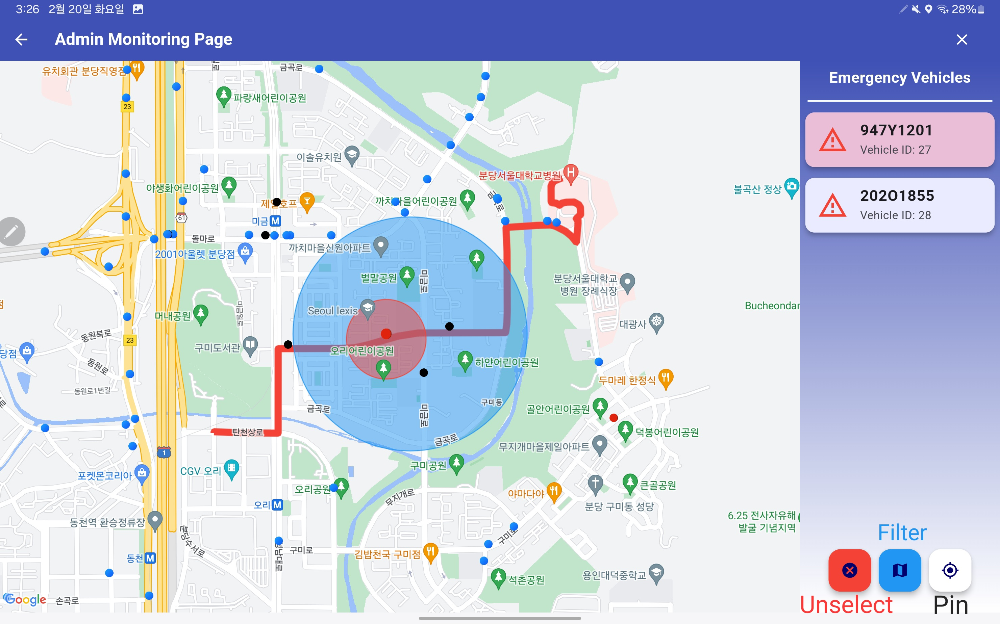

## Install & Execute for Test

> In Korea, not all Google Map APIs are supported due to national security reasons. Because of this, the real test needs to be run in Korea, so I recommend you to try it out through this easy simulation method.

### 1. Install app

[Download apk file](https://github.com/Ajou-Soft-19/service-app/releases/tag/v1.0.1) on your Android device

|Download from Assets|Install Anyway|Install Success|
|---|---|---|
|||

### 2. Turn on Monitoring Page

1. Run EPAS
2. Accept Location Permission

| Location Permission Screen | Initial Screen                         | User Info Screen |
|-------------|---------------------------------|------------------------------------|
|  |  |  |
|You need to set location permissions to run the app.|This is the map page for general users. By pressing the settings button, you will be taken to the account information page.|You can log in here.|

3. Sign in with Admin account

|ID|PW|
|-|-|
|`adminepas@ajou.ac.kr`|`adminepas1234!?`|

4. Click Monitoring Page

| Admin Page |  
|-------------|
|  |

### 3. Run simulation

1. Clone Repository

    ```bash
    git clone https://github.com/Ajou-Soft-19/road-simulator.git
    # then move to repository directory
    ```

2. Test Environment Installation

    ```bash
    npm i
    ```

3. Test Case Creation

    ```bash
    npm run init
    ```

4. Running the simulatioin

    ```bash
    npm run sim
    ```

### 4. Watch Monitoring Page

| Initial Screen |  
|-------------|
|  |

| Vehicle Information |  
|-------------|
|  |
> The small dots on the screen represent vehicles. When you click a dot, the vehicle information pops up in a modal window.

| Dots | Explanation |
|------|-------------|
||Emergency Vehicles|
||Not-Alerted Vehicles|
||Alerted Vehicles|

By selecting the emergency vehicle on the right, you can check the emergency path, checkpoints, etc. of the emergency vehicle. In addition, vehicles that have received alerts from the emergency vehicle are displayed in black in real time on the screen. You can deselect by pressing the `x` button.

| Emergency Vehicle Confirmation |  
|-------------|
|  |
> You can see the path and alert boundary for each emergency vehicle.

- You can cancel the vehicle selection with the `Unselect` button.
- You can define the range of the area displayed on the screen with the `Filter` button.
- You can pin the screen to the selected vehicle with the `Pin` button.